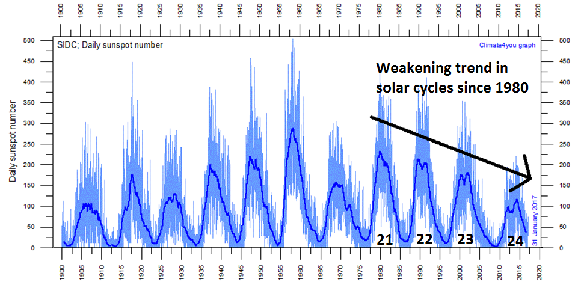

# ast596fds-final
Final group project for Frank Fu, Sihan Li, Jennifer Li, Chris Tandoi

# Project proposal:
Astrophysical dataset that we find interesting. Project must satisfy (at least) two of:

	- time-series analysis
    - hierarchical Bayesian modeling
    - dealing with selection effects in data when building models
    - machine learning

------------------------
Sunspot modeling and prediction based on historical data located at
- https://www.ngdc.noaa.gov/stp/space-weather/solar-data/solar-indices/sunspot-numbers/american/tables/
- http://www.sidc.be/silso/datafiles

Possible scientific questions:
1) Characterize the variability of sunspot numbers using different statistical tools
2) Make a model for prediction
3) Discuss how significance the weakening trend is (or other trends in the variability)

Also interesting to add to our final writeup: history of sunspot detection, dating back from ~800BC in China (Book of Changes) to first telescopically observed sunspots in the early 1600's

Some reference images:

# Statement of work:
How do we want to accomplish this? Think about final outcome, work backwards on how to get there. What is needed at each step? Work will be done in Jupyter notebook

------------------------

Methods:
1) PCA analysis on different timescales, show some analysis on counting uncertainties
2) For the predicting model: something similar to previous homeworks
3) Use MCMC with the model to quantify significance of certain trends

# Tasks:

### Frank Fu
- Fourier Component reconstruction (nb2)
    - Inspired by Chris's Sinusoidal decomposition I decided to do a full Fourier domain decomposition and see if we can reasonably reconstruct the data with only the lower frequency components. The idea worked and we have some adequate predictions generated. I've tried playing with the cutoff parameter to see if it will change the prediction but the impact is quite small.
- Gaussian Process regression on Monthly data (nb1)
    - Solar activity is rather stochastic so a better approach to model the data is using Gaussian processes. Initially, I wasn't able to get a stable result with a flat prior. After some discussion, we decided to implement some specific priors for each of the parameters. With logP(dominates the short-term behavior) and logM(regulates the long-term variation) limited by the prior, we managed to have converged chains and a decent short-term prediction.
    - Limited by the computing power we can only use a portion of the monthly data. I've tried using different selections of data, i.e. dense but less solar cycles vs sparse and more solar cycles and it turns out the latter one works better for prediction as it constrains more of the long term variation.

### Sihan Li
- Regression and find the period
    - Foucused on the Daily sunspots number dataset. Tried to build up a linear regression model. Calulated the possible period based on the model.Tried to label the independent variable periodically.
- Machine Learning (Comparison and analysis)
    - Tried to ues different ML methods to predict the data. Devided the whole dataset into 67% training data and 33% testing data. Tried to compared different methods (KNN, RF, LDA). In my model for this dataset, KNN has the highest accuracy. 
    - The expected result should be a plot of the comparison between predicted data and original data. However the codes failed at the last step. I guess, if possible, I can label the independent variable better based on its periodical feature.

### Jennifer Li
- Perform basic time analysis (Periodogram, ACF) and cross-correlation analysis on sunspot data and temperature data
- Gaussian process regression on modeling and forecasting temperature data
- Collect earth surface temperature data and read relevant literature on global warming and solar activity

### Chris Tandoi
- MCMC modeling
    - Tried a naive approach at a basic model for sunspot numbers. The MCMC result led to an almost identical result as my initial guess, which tells me my guess parameters for my model were close to perfect, but in the end the model was very limited. More advanced techniques were the logical outcome of this, and it seemed like comparing this to an actual Fourier transform on the data would be a good next step.
- History/intro
    - Read up on a bunch of sunspot detection history. Really interesting stuff and I'd like to do an AoT about the sun/space weather in general. The actual science behind it might be impossibly hard but the history of all of it is super interesting.
- Conclusion
    - Tried to read Li He's paper. It was a math PhD thesis though so a lot of it was technical jargon and formal proofs that are wasted on my tiny brain. Finding at the conclusion that "none of this ends up working at all" was extremely validating.

### Group stuff
- Maintained a slack channel over the duration of this project to stay in communication and share info/ask for help.
- Built up presentation over Google slides
- Zoom meetings
    - April 23, 2020: initial meetup to figure out what we wanted to work on, specific tasks, and how we wanted to organize everything.
    - May 14, 2020: final meetup to consolidate all of our efforts and thoughts. Any last minute problems any individuals were facing were (attempted to be) addressed.